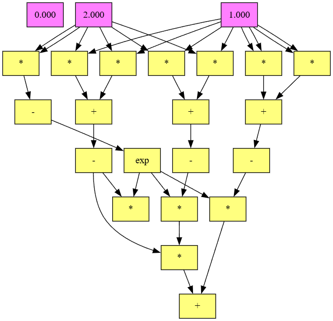
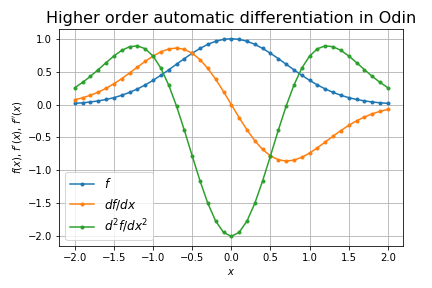

# odigrad

Automatic differentiation in Odin

## Overview

We implemented autograd in [Rust](https://github.com/msakuta/rustograd), [Zig](https://github.com/msakuta/zigrad), [Scala](https://github.com/msakuta/scagrad) and [Swift](https://github.com/msakuta/swigrad).

## How to run

* Install [Odin language](https://odin-lang.org/).
* `odin run .` for the basic test
* `odin run . -- gaussian` for the higher order differentiation of a Gaussian function